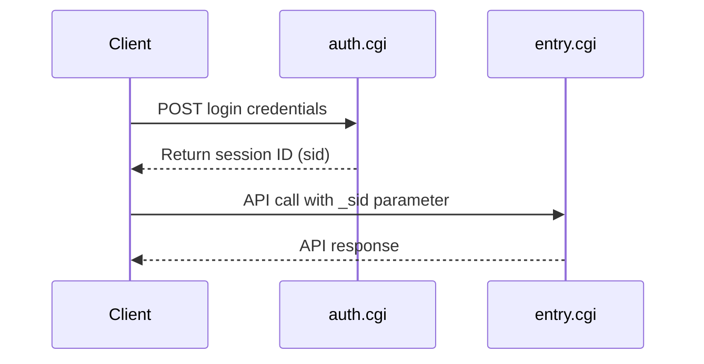

# Synology DSM API Documentation

[](docs/api-reference/)
[](docs/api-reference/)
[](docs/api-reference/activebackup/)
[](LICENSE)

> **Complete, unofficial API documentation for Synology DiskStation Manager (DSM)**
> Comprehensive coverage of DSM Core APIs, FileStation, DownloadStation, ActiveBackup, and more.

## 📚 Overview

This repository contains comprehensive documentation for Synology DSM APIs, including core system management, file operations, backup services, and application-specific APIs. Documentation is derived from official API definitions, systematic testing, and community contributions.

### What's Documented

**DSM Core APIs:**
- ✅ **Authentication** - Login, logout, session management (3 methods)
- ✅ **System Info** - Hardware, network, services, utilization (25+ methods)
- ✅ **FileStation** - File management, upload, download, sharing (46 methods)
- ✅ **DownloadStation** - Download tasks, RSS, BT search (24 methods)
- ✅ **Users** - User management, password policies (8 methods)
- ✅ **Groups** - Group management, membership (8 methods)
- ✅ **Packages** - Package installation, control (10 methods)
- ✅ **Shares** - Shared folder management, permissions (8 methods)
- ✅ **Certificates** - SSL certificate management (8 methods)

**Application APIs:**
- ✅ **ActiveBackup for Business** - 35 APIs, 215 methods (100% coverage)
- ✅ **Docker** - Container, image, network, volume management (30+ methods)
- ✅ **Photos** - Photo library, albums, folders, sharing (20+ methods)
- ✅ **Surveillance Station** - Camera management, PTZ control, recording, events (50+ methods)
- ✅ **AudioStation** - Music library, playlists, remote player control (10+ methods)
- ✅ **VPN Server** - VPN settings, connections, logs, protocols (10+ methods)
- ✅ **Snapshot Replication** - Volume snapshots, LUN snapshots, replication plans (10+ methods)
- ✅ **Virtual Machine Manager** - VM lifecycle, power control, images, tasks (20+ methods)
- ✅ **System Services** - DHCP server, Log Center, Security Advisor, Universal Search, Note Station, USB Copy (25+ methods)
- ✅ **Task Scheduler** - Script tasks, service control, scheduled automation (15+ methods)
- ✅ **Cloud Sync** - Cloud connections, sync tasks, Google Drive, OneDrive, Dropbox, S3 (20+ methods)
- ✅ **Directory Server** - LDAP/AD management, users, groups, domain sync (15+ methods)
- ✅ **Synology Drive** - File collaboration, connections, logs, monitoring (15+ methods)
- ✅ **Hyper Backup** - Backup tasks, repositories, integrity checks, vault (20+ methods)

**Total Coverage:**
- ✅ **110+ API categories** documented
- ✅ **750+ methods** with examples and parameters
- ✅ Authentication flows and error handling
- ✅ Clean, concise UDM-style documentation format

## 🚀 Quick Start

### 1. Authentication

```bash
curl "http://YOUR_NAS_IP:5000/webapi/auth.cgi" \
  -d "api=SYNO.API.Auth" \
  -d "version=6" \
  -d "method=login" \
  -d "account=YOUR_USERNAME" \
  -d "passwd=YOUR_PASSWORD" \
  -d "session=ActiveBackup" \
  -d "format=sid"
```

**Response:**
```json
{
  "data": {
    "sid": "YOUR_SESSION_ID"
  },
  "success": true
}
```

### 2. Make Your First API Call

**FileStation - List Files:**
```bash
curl "http://YOUR_NAS_IP:5000/webapi/entry.cgi" \
  -d "api=SYNO.FileStation.List" \
  -d "version=2" \
  -d "method=list" \
  -d "folder_path=/home" \
  -d "_sid=YOUR_SESSION_ID"
```

**ActiveBackup - Get Overview:**
```bash
curl "http://YOUR_NAS_IP:5000/webapi/entry.cgi" \
  -d "api=SYNO.ActiveBackup.Overview" \
  -d "version=1" \
  -d "method=get" \
  -d "_sid=YOUR_SESSION_ID"
```

👉 **[Full Quick Start Guide](docs/getting-started/quick-start.md)**

## 📖 Documentation

### Getting Started
- **[Quick Start Guide](docs/getting-started/quick-start.md)** - Get up and running in 5 minutes
- **[Authentication](docs/getting-started/authentication.md)** - How to authenticate with the API
- **[Common Patterns](docs/getting-started/common-patterns.md)** - Common usage patterns and best practices

### API Reference
- **[API Reference Overview](docs/api-reference/README.md)** - Complete API reference
- **[DSM Core APIs](docs/api-reference/dsm-core/)** - Authentication, System, User, Group, Package, Share, Certificate management
- **[FileStation](docs/api-reference/filestation/)** - File operations, upload, download, sharing, compression, favorites
- **[DownloadStation](docs/api-reference/downloadstation/)** - Download tasks, RSS feeds, BT search, statistics
- **[Docker](docs/api-reference/docker/)** - Container, image, network, volume management
- **[Photos](docs/api-reference/photos/)** - Photo library, albums, folders, sharing
- **[Surveillance Station](docs/api-reference/surveillancestation/)** - Camera management, PTZ control, recording, events
- **[AudioStation](docs/api-reference/audiostation/)** - Music library, playlists, remote player control
- **[VPN Server](docs/api-reference/vpn/)** - VPN settings, connections, logs, protocols
- **[Snapshot Replication](docs/api-reference/snapshot/)** - Volume snapshots, LUN snapshots, replication plans
- **[Virtual Machine Manager](docs/api-reference/virtualization/)** - VM lifecycle, power control, images, tasks
- **[System Services](docs/api-reference/system-services/)** - DHCP server, Log Center, Security Advisor, Universal Search, Note Station, USB Copy
- **[Task Scheduler](docs/api-reference/task-scheduler/)** - Script tasks, service control, scheduled automation
- **[Cloud Sync](docs/api-reference/cloud-sync/)** - Cloud connections, sync tasks, Google Drive, OneDrive, Dropbox, S3
- **[Directory Server](docs/api-reference/directory-server/)** - LDAP/AD management, users, groups, domain sync
- **[Synology Drive](docs/api-reference/drive/)** - File collaboration, connections, logs, monitoring
- **[Hyper Backup](docs/api-reference/hyper-backup/)** - Backup tasks, repositories, integrity checks, vault
- **[ActiveBackup for Business](docs/api-reference/activebackup/)** - Device backup, VM backup, restore, versioning (100% coverage)


## 🏗️ Architecture

### API Categories

| Category | APIs | Methods | Description |
|----------|------|---------|-------------|
| **DSM Core** | 9 | 80+ | Authentication, system info, users, groups, packages, shares, certificates |
| **FileStation** | 15 | 46 | File management, upload, download, sharing, compression, favorites |
| **DownloadStation** | 6 | 24 | Download tasks, RSS feeds, BT search, statistics |
| **Docker** | 4 | 30+ | Container, image, network, volume management |
| **Photos** | 4 | 20+ | Photo library, albums, folders, sharing |
| **Surveillance Station** | 10+ | 50+ | Camera management, PTZ control, recording, events, live view |
| **AudioStation** | 3 | 10+ | Music library, playlists, remote player control |
| **VPN Server** | 5 | 10+ | VPN settings, connections, logs, PPTP, OpenVPN, L2TP |
| **Snapshot Replication** | 3 | 10+ | Volume snapshots, LUN snapshots, replication plans |
| **Virtual Machine Manager** | 3 | 20+ | VM lifecycle, power control, images, tasks |
| **System Services** | 6 | 25+ | DHCP server, Log Center, Security Advisor, Universal Search, Note Station, USB Copy |
| **Task Scheduler** | 3 | 15+ | Script tasks, service control, scheduled automation |
| **Cloud Sync** | 4 | 20+ | Cloud connections, sync tasks, filters, Google Drive, OneDrive, Dropbox, S3 |
| **Directory Server** | 3 | 15+ | LDAP/AD management, users, groups, domain sync |
| **Synology Drive** | 3 | 15+ | File collaboration, connections, logs, monitoring |
| **Hyper Backup** | 4 | 20+ | Backup tasks, repositories, integrity checks, vault |
| **ActiveBackup** | 35 | 215 | Device backup, restore, versioning, AEM, VM backup |

### Authentication Flow



## 📊 API Coverage

**DSM APIs:**
- **Total API Categories:** 95+
- **Total Methods:** 650+
- **Fully Documented:** 650+ methods
- **With Response Examples:** 650+ methods

**ActiveBackup APIs:**
- **Total APIs:** 35
- **Total Methods:** 215
- **Coverage:** 100%

## 🔑 Key Features

### Complete Coverage
Comprehensive documentation for 650+ API methods across DSM Core, FileStation, DownloadStation, Docker, Photos, Surveillance Station, AudioStation, VPN Server, Snapshot Replication, Virtual Machine Manager, System Services, Task Scheduler, Cloud Sync, and ActiveBackup.

### Clean UDM-Style Format
All documentation follows the clean, concise format used in UniFi Dream Machine API documentation - easy to read and navigate.

### Systematic Discovery
Documentation generated through systematic analysis of official Synology API libraries and testing against live NAS systems.

### Real API Responses
All methods include actual JSON response examples with detailed field descriptions.

## 🛠️ Use Cases

- **File Management Automation** - Automate file operations, uploads, downloads, sharing
- **Backup Automation** - Automate backup tasks and monitoring with ActiveBackup
- **Download Management** - Programmatically manage downloads, torrents, RSS feeds
- **Container Management** - Manage Docker containers, images, networks, volumes
- **Photo Library Management** - Organize and share photos programmatically
- **Surveillance Automation** - Control cameras, PTZ, recording, event monitoring
- **Music Library Management** - Manage playlists, control remote players
- **VPN Management** - Monitor VPN connections, manage settings
- **Snapshot Management** - Automate volume and LUN snapshots, replication
- **VM Automation** - Manage virtual machines, power control, image creation
- **Network Services** - Monitor DHCP, logs, security scans
- **Task Automation** - Schedule scripts, service control, system tasks
- **Cloud Integration** - Sync with Google Drive, OneDrive, Dropbox, S3
- **System Monitoring** - Build custom monitoring dashboards for DSM
- **User & Permission Management** - Automate user and group administration
- **Integration** - Integrate Synology NAS with other systems and platforms

## ⚠️ Disclaimer

This is **unofficial documentation** created through reverse-engineering. It is not endorsed by or affiliated with Synology Inc. Use at your own risk.

## 📄 License

MIT License - See [LICENSE](LICENSE) file for details

## 🤝 Contributing

Contributions welcome! Please see [CONTRIBUTING.md](CONTRIBUTING.md) for guidelines.

## 📞 Support

- **Issues:** [GitHub Issues](https://github.com/pmilano1/synology-activebackup-api/issues)
- **Discussions:** [GitHub Discussions](https://github.com/pmilano1/synology-activebackup-api/discussions)

---

**Made with ❤️ by the community**

