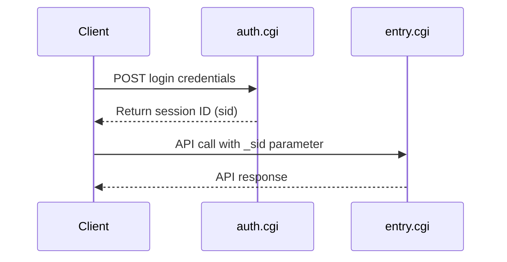

# Synology ActiveBackup for Business API Documentation

[](docs/api-reference/)
[](docs/api-reference/)
[](docs/api-reference/)
[](LICENSE)

> **Complete, unofficial API documentation for Synology ActiveBackup for Business**  
> Reverse-engineered through systematic testing of all 215 API methods across 35 APIs.

## 📚 Overview

This repository contains comprehensive documentation for the Synology ActiveBackup for Business API, discovered through systematic reverse-engineering of the official API definition files. This is the most complete documentation available for this API.

### What's Documented

- ✅ **35 APIs** fully documented
- ✅ **215 methods** tested and documented (100% coverage)
- ✅ **74 methods** with full JSON response examples
- ✅ **141 methods** with detailed parameter requirements
- ✅ Authentication flows and error handling
- ✅ Real-world usage examples in multiple languages

## 🚀 Quick Start

### 1. Authentication

```bash
curl "http://YOUR_NAS_IP:5000/webapi/auth.cgi" \
  -d "api=SYNO.API.Auth" \
  -d "version=6" \
  -d "method=login" \
  -d "account=YOUR_USERNAME" \
  -d "passwd=YOUR_PASSWORD" \
  -d "session=ActiveBackup" \
  -d "format=sid"
```

**Response:**
```json
{
  "data": {
    "sid": "YOUR_SESSION_ID"
  },
  "success": true
}
```

### 2. Make Your First API Call

```bash
curl "http://YOUR_NAS_IP:5000/webapi/entry.cgi" \
  -d "api=SYNO.ActiveBackup.Overview" \
  -d "version=1" \
  -d "method=get" \
  -d "_sid=YOUR_SESSION_ID"
```

👉 **[Full Quick Start Guide](docs/getting-started/quick-start.md)**

## 📖 Documentation

### Getting Started
- **[Quick Start Guide](docs/getting-started/quick-start.md)** - Get up and running in 5 minutes
- **[Authentication](docs/getting-started/authentication.md)** - How to authenticate with the API
- **[Common Patterns](docs/getting-started/common-patterns.md)** - Common usage patterns and best practices

### API Reference
- **[API Reference Overview](docs/api-reference/README.md)** - Complete API reference
- **[Core Backup APIs](docs/api-reference/core/)** - Device, Task, Version, Restore
- **[Apple Enterprise Management](docs/api-reference/aem/)** - AEM APIs for Apple devices
- **[VM Backup & Restore](docs/api-reference/vm/)** - VMware and Hyper-V APIs
- **[System Management](docs/api-reference/system/)** - Storage, Logging, Configuration

### Guides
- **[Backup Workflows](docs/guides/backup-workflows.md)** - Common backup scenarios
- **[Restore Workflows](docs/guides/restore-workflows.md)** - Restore operations
- **[Error Handling](docs/guides/error-handling.md)** - Error codes and troubleshooting
- **[Best Practices](docs/guides/best-practices.md)** - API best practices

### Examples
- **[Python Examples](docs/examples/python/)** - Complete Python examples
- **[JavaScript Examples](docs/examples/javascript/)** - Node.js examples
- **[cURL Examples](docs/examples/curl/)** - Command-line examples

## 🏗️ Architecture

### API Categories

| Category | APIs | Methods | Description |
|----------|------|---------|-------------|
| **Core Backup** | 5 | 45 | Device, Task, Version, Restore, Settings |
| **Apple Enterprise** | 7 | 43 | AEM backup and management |
| **VM Backup** | 2 | 41 | VMware and Hyper-V backup/restore |
| **System Management** | 9 | 48 | Storage, Logging, Configuration |
| **Agent Management** | 3 | 18 | Agent and agentless backup |
| **Integration** | 4 | 7 | Domain, LDAP, NFS integration |
| **Other** | 5 | 13 | Plans, Reports, Templates |

### Authentication Flow



## 📊 API Coverage

- **Total APIs:** 35
- **Total Methods:** 215
- **Fully Tested:** 74 methods (34%)
- **Parameter Requirements Documented:** 141 methods (66%)
- **Coverage:** 100%

## 🔑 Key Features

### Complete Coverage
Every single method from the official API definition is documented with either full response examples or detailed parameter requirements.

### Real API Responses
74 methods include actual JSON responses captured from a live Synology NAS running ActiveBackup for Business.

### Systematic Discovery
Documentation generated through systematic testing using the official API definition file, not guesswork.

### Multiple Languages
Examples provided in Python, JavaScript, and cURL for easy integration.

## 🛠️ Use Cases

- **Automation** - Automate backup tasks and monitoring
- **Integration** - Integrate ActiveBackup with other systems
- **Monitoring** - Build custom monitoring dashboards
- **Reporting** - Generate custom backup reports
- **Management** - Programmatically manage backup infrastructure

## ⚠️ Disclaimer

This is **unofficial documentation** created through reverse-engineering. It is not endorsed by or affiliated with Synology Inc. Use at your own risk.

## 📄 License

MIT License - See [LICENSE](LICENSE) file for details

## 🤝 Contributing

Contributions welcome! Please see [CONTRIBUTING.md](CONTRIBUTING.md) for guidelines.

## 📞 Support

- **Issues:** [GitHub Issues](https://github.com/milanese-org/synology-activebackup-api/issues)
- **Discussions:** [GitHub Discussions](https://github.com/milanese-org/synology-activebackup-api/discussions)

---

**Made with ❤️ by the community**

