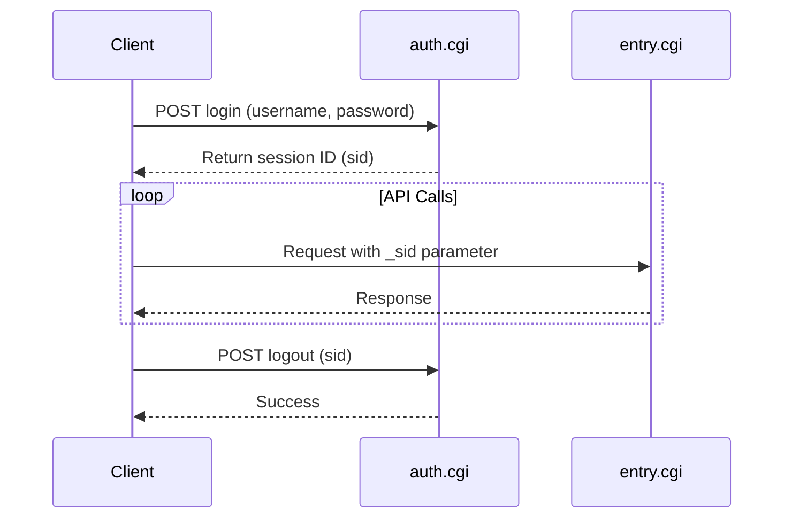

# Authentication

Learn how to authenticate with the Synology ActiveBackup for Business API.

## Overview

The ActiveBackup API uses session-based authentication through the Synology API Auth system. You must:

1. Login to obtain a session ID (`sid`)
2. Include the session ID in all subsequent API calls
3. Logout when done (optional but recommended)

## Authentication Flow



## Login

### Endpoint

```
POST http://YOUR_NAS_IP:5000/webapi/auth.cgi
```

### Parameters

| Parameter | Required | Description |
|-----------|----------|-------------|
| `api` | Yes | Must be `SYNO.API.Auth` |
| `version` | Yes | Must be `6` |
| `method` | Yes | Must be `login` |
| `account` | Yes | Username (typically `admin`) |
| `passwd` | Yes | Password |
| `session` | Yes | Must be `ActiveBackup` |
| `format` | Yes | Must be `sid` |

### Example Request

```bash
curl -X POST "http://192.168.1.100:5000/webapi/auth.cgi" \
  -d "api=SYNO.API.Auth" \
  -d "version=6" \
  -d "method=login" \
  -d "account=admin" \
  -d "passwd=MyPassword123" \
  -d "session=ActiveBackup" \
  -d "format=sid"
```

### Success Response

```json
{
  "data": {
    "sid": "AbCdEfGhIjKlMnOpQrStUvWxYz123456"
  },
  "success": true
}
```

### Error Response

```json
{
  "error": {
    "code": 400
  },
  "success": false
}
```

## Using the Session ID

Once you have a session ID, include it in all API calls using the `_sid` parameter:

```bash
curl "http://192.168.1.100:5000/webapi/entry.cgi" \
  -d "api=SYNO.ActiveBackup.Overview" \
  -d "version=1" \
  -d "method=get" \
  -d "_sid=AbCdEfGhIjKlMnOpQrStUvWxYz123456"
```

## Session Management

### Session Lifetime

- Sessions expire after **30 minutes** of inactivity
- Each API call resets the inactivity timer
- Maximum session lifetime is typically **24 hours**

### Session Reuse

You can reuse the same session ID for multiple API calls:

```python
import requests

class ActiveBackupClient:
    def __init__(self, host, username, password):
        self.host = host
        self.base_url = f"http://{host}:5000/webapi"
        self.sid = None
        self.login(username, password)
    
    def login(self, username, password):
        response = requests.post(
            f"{self.base_url}/auth.cgi",
            data={
                "api": "SYNO.API.Auth",
                "version": "6",
                "method": "login",
                "account": username,
                "passwd": password,
                "session": "ActiveBackup",
                "format": "sid"
            }
        )
        data = response.json()
        if data.get("success"):
            self.sid = data["data"]["sid"]
        else:
            raise Exception(f"Login failed: {data}")
    
    def call_api(self, api, method, **params):
        params.update({
            "api": api,
            "version": "1",
            "method": method,
            "_sid": self.sid
        })
        response = requests.get(f"{self.base_url}/entry.cgi", params=params)
        return response.json()

# Usage
client = ActiveBackupClient("192.168.1.100", "admin", "password")
overview = client.call_api("SYNO.ActiveBackup.Overview", "get")
devices = client.call_api("SYNO.ActiveBackup.Device", "list")
```

## Logout

### Endpoint

```
POST http://YOUR_NAS_IP:5000/webapi/auth.cgi
```

### Parameters

| Parameter | Required | Description |
|-----------|----------|-------------|
| `api` | Yes | Must be `SYNO.API.Auth` |
| `version` | Yes | Must be `6` |
| `method` | Yes | Must be `logout` |
| `session` | Yes | Must be `ActiveBackup` |
| `_sid` | Yes | Your session ID |

### Example Request

```bash
curl -X POST "http://192.168.1.100:5000/webapi/auth.cgi" \
  -d "api=SYNO.API.Auth" \
  -d "version=6" \
  -d "method=logout" \
  -d "session=ActiveBackup" \
  -d "_sid=AbCdEfGhIjKlMnOpQrStUvWxYz123456"
```

### Response

```json
{
  "success": true
}
```

## Security Best Practices

### 1. Use HTTPS

Always use HTTPS in production:

```python
base_url = f"https://{host}:5001/webapi"  # Port 5001 for HTTPS
```

### 2. Store Credentials Securely

Never hardcode credentials:

```python
import os

username = os.environ.get("SYNOLOGY_USERNAME")
password = os.environ.get("SYNOLOGY_PASSWORD")
```

### 3. Handle Session Expiration

Implement automatic re-authentication:

```python
def call_api_with_retry(self, api, method, **params):
    try:
        return self.call_api(api, method, **params)
    except SessionExpiredError:
        self.login(self.username, self.password)
        return self.call_api(api, method, **params)
```

### 4. Logout When Done

Always logout to free server resources:

```python
try:
    # Your API calls
    pass
finally:
    client.logout()
```

## Common Authentication Errors

| Error Code | Description | Solution |
|------------|-------------|----------|
| 400 | Invalid credentials | Check username and password |
| 401 | Account disabled | Enable the account in DSM |
| 402 | Permission denied | Use an admin account |
| 403 | One-time password required | Disable 2FA or provide OTP |
| 404 | Account does not exist | Verify username |

## Next Steps

- **[Quick Start Guide](quick-start.md)** - Make your first API call
- **[Common Patterns](common-patterns.md)** - Learn common usage patterns
- **[Error Handling](../guides/error-handling.md)** - Handle errors gracefully

